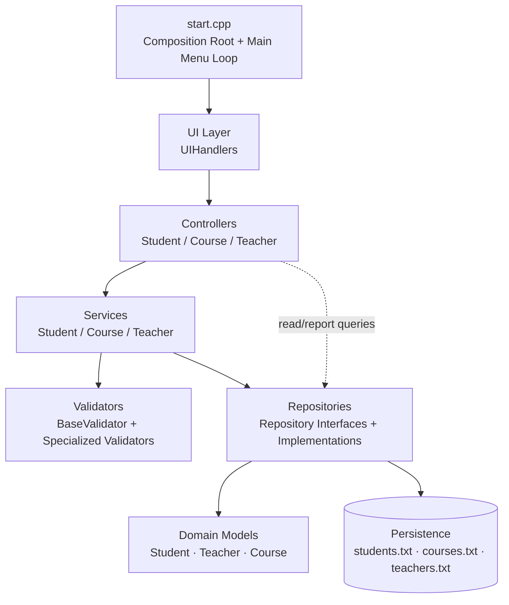
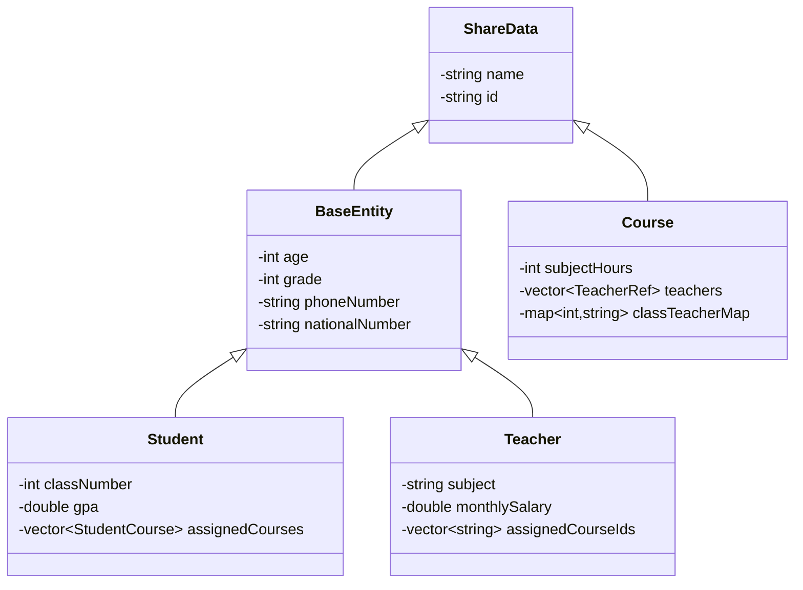

<h1 align="center">School Management System</h1>

<p align="center">
  <strong>Layered C++ Application for School Administration</strong>
</p>

<p align="center">
  
  
</p>

A console-based **School Management System** written in modern **C++** that manages students, teachers, and courses for a school organized into grades 1–12. Built around a layered object-oriented architecture (UI → Controllers → Services → Repositories → Domain Models), it enforces real-world school policies through dedicated validation and service layers, and persists all data to local text files between sessions.

---

## Overview

This project addresses the day-to-day administration of a K-12 style school: registering students, hiring teachers, creating courses, and keeping enrollments and teaching assignments consistent with each other.

It is a fully interactive **console application**. On startup, previously saved data is loaded from local text files, then the user navigates a menu-driven workflow:

1. **About Student** – register, edit, remove students; assign courses; view rosters.
2. **About Course** – create, edit, remove courses; inspect enrollment; replace teachers.
3. **About Teacher** – hire, edit, remove teachers; assign/unassign courses and classes.
4. **Exit** – saves all data back to disk before terminating.

Every mutation is validated against configurable business rules (capacity limits, age ranges, specialization matching, seat availability), and related entities are kept consistent automatically — for example, removing a student automatically unenrolls them from all their courses.

## Features

### Student Management

- Register students with name, national number, grade, age, and phone number; a unique ID (year-prefixed, e.g. `2019001`) and a class section (`grade/class`) are assigned automatically.
- Remove students (with confirmation) — enrollment records in affected courses are cleaned up automatically.
- Edit student details; changing grade regenerates the ID and clears course registrations that belong to the old grade.
- Assign courses to a student from their grade level, selecting the teacher for each course; enforced against per-stage course requirements and course capacity.
- View full student profile including registered courses, teachers, and remaining required courses.
- List all students in a grade, or sorted by GPA (descending), in formatted color-coded tables.

### Teacher Management

- Hire teachers with validation of age (23–60), experience (≥ 2 years), minimum salary (7000), and a 14-digit national number; IDs follow the pattern `<grade><counter>` (e.g. `1001`).
- Remove teachers — blocked while any of their courses still has enrolled students.
- Edit teacher records; specialization changes detach the teacher from now-mismatched empty courses; grade changes regenerate the ID and clear assignments outside the new grade.
- Assign up to 3 courses to a teacher with explicit class selection (classes 1–4 per grade), enforcing same-school-stage placement, specialization match, free class slots, and minimum available seats.
- Unassign a course from a teacher (only when no students are enrolled; use _Replace Teacher_ otherwise).
- Replace a teacher inside a course — enrolled students' records are updated to reference the new teacher automatically.
- View teacher profiles including assigned courses and the exact classes taught; list teachers per grade with distinct student counts.

### Course Management

- Create courses per grade with subject hours (2–6) and specialization; duplicates (same name + grade + specialization) are rejected; IDs are generated from the course attributes (e.g. `math-5-science001`).
- Remove courses — blocked while students remain enrolled; teacher assignments are cascaded away first.
- Edit courses — blocked once students are enrolled; grade moves must stay within the same school stage and regenerate the course ID; specialization changes drop non-matching teachers.
- Inspect a course's roster: all assigned students, or filtered by a specific teacher.
- List all courses in a grade with enrollment and teacher counts.

### Data Persistence

- All state is saved to `students.txt`, `courses.txt`, and `teachers.txt` after each successful operation and on exit.
- Saves are **atomic** (written to a `.tmp` file, then renamed) so interrupted writes do not corrupt existing data.
- Corrupt or truncated files are detected on load; bad data is discarded safely and the program starts fresh rather than crashing.

### Validation & Feedback

- Centralized validators enforce field-level rules (names, national numbers, digit-only phone numbers, GPA range 0–4, grade range 1–12, age-to-grade consistency).
- Capacity management per school stage (Primary / Middle / Secondary) caps students, teachers, and courses per grade.
- Every failed operation returns a specific, human-readable error message; numeric input parsing never crashes on invalid input.

## System Architecture

The application follows a strict **layered architecture** with dependency injection via constructor references:


| Layer                         | Responsibility                                                                                                                                                                |
| ----------------------------- | ----------------------------------------------------------------------------------------------------------------------------------------------------------------------------- |
| **Entry point** (`start.cpp`) | Wires all objects together (repositories → validators → services → controllers), loads persisted data, runs the main menu loop.                                               |
| **UI** (`ui/UIHandlers`)      | Menus, prompts, safe numeric input (`readInt`/`readDouble`), confirmation dialogs.                                                                                            |
| **Controllers**               | Orchestrate display concerns: profile views, formatted tables, sorting for reports, triggering saves.                                                                         |
| **Services**                  | Core business logic: policy enforcement (capacities, stage rules, specialization matches), multi-entity consistency (cascade updates), and aggregation of validation results. |
| **Validators**                | Field-level rule checks, reused across entities through a shared base class.                                                                                                  |
| **Repositories**              | Own the in-memory collections plus grade/stage indexes, generate unique IDs, serialize/deserialize to text files.                                                             |
| **Models**                    | Pure domain classes holding entity state and entity-level behavior (e.g., `Course::assignTeacher`, `Student::isCourseAssigned`).                                              |

**Program flow:** `main()` constructs the object graph and loads the three data files. The main loop dispatches to branch handlers in the UI layer, which prompt for input, call controllers, and print results. Controllers delegate mutations to services (which validate and enforce policy, then call repositories) and query repositories/services for reporting. After successful mutations, controllers persist all three datasets via `SaveManager::saveAll`.

## Object-Oriented Design

### Encapsulation

All domain classes keep their state `private` and expose controlled accessors. More importantly, they encapsulate _behavior and invariants_, not just data:

- `Student::assignCourse()` refuses duplicate course assignments; callers cannot corrupt the internal course list directly.
- `Course::assignTeacherToClass()` guarantees a class slot maps to exactly one teacher.
- `Teacher::removeCourse()` keeps the course-ID list internally consistent.
- Repositories hide index maintenance entirely — `addStudent`, `editStudent`, and `removeStudent` transparently update `gradeIndex` and `stageIndex` so callers never touch the indexing structures.

### Abstraction

Each subsystem communicates through small abstract interfaces rather than concrete implementations:

- `StudentRepository`, `CourseRepository`, `TeacherRepository` — pure-virtual persistence contracts.
- `StudentService`, `CourseService`, `TeacherService` — pure-virtual business-logic contracts.

The UI and controller layers operate on these abstractions; storage details (text files, indexing) are invisible above the repository boundary. `main()` explicitly binds implementations to interfaces:

```cpp
StudentRepositoryImpl studentRepoImpl;
...
StudentRepository& studentRepo = studentRepoImpl;
```

### Inheritance

Two independent hierarchies exist:

**Domain models** (`models/`):



`ShareData` factors out the identity fields (`name`, `id`) shared by every entity; `BaseEntity` adds person-level fields used by both `Student` and `Teacher`.

**Validators** (`validators/`): `BaseValidator` provides shared checks (name, national number, grade, specialization); `StudentValidator`, `TeacherValidator`, and `CourseValidator` extend it with entity-specific rules.

### Polymorphism

Runtime polymorphism is used throughout via abstract bases and overridden methods:

- Repository and service interfaces declare pure-virtual methods; the `...Impl` classes override them using the `override` specifier.
- All hierarchies define virtual destructors (`virtual ~T() = default`) enabling safe deletion through base pointers/references.
- The whole application runs through base-class references (e.g., `CourseService& courseService = courseServiceImpl;`), so virtual dispatch selects the implementation at runtime. Swapping a repository implementation would not require changes above the service layer.

### Composition / Aggregation

Entities own or reference other entities by value and by identifier:

- `Student` **has** a `std::vector<StudentCourse>` (course + teacher pairs) — composition.
- `Course` **owns** a roster of enrolled student IDs, a `std::vector<TeacherRef>`, and a `std::map<int, std::string>` mapping class sections to teacher IDs — composition.
- `Teacher` **aggregates** courses as a list of course IDs (`assignedCourseIds`), resolved against the course repository when needed.
- Services and controllers **aggregate** their collaborators by reference (repositories, validators), injected through constructors.

### Other OOP Concepts

- **Generic programming (templates):** `BaseRepository<T>` provides shared storage, dual indexing, atomic-save plumbing, and corruption handling for all three repository implementations.
- **Multiple inheritance (interfaces):** each `...RepositoryImpl` inherits both its abstract interface and `BaseRepository<T>`.
- **Constructors & initialization:** constructor member-initializer lists wire dependencies; default constructors initialize counters and defaults.
- **Scoped enums:** `enum class Stage { Primary, Middle, Secondary }` drives all per-stage policy lookups.
- **Namespaces:** `SchoolConstants` centralizes every tunable business constant.

## Project Structure

```text
SchoolManagementSystem/
├── start.cpp                        # Entry point: wiring, data loading, main menu loop
├── common/                          # Shared utilities and configuration
│   ├── SchoolConstants.h            # Business rules & limits (grades, capacities, file names)
│   ├── SchoolUtils.h                # Stage enum, grade→stage helpers, ID formatting
│   ├── ValidatorUtils.h             # Reusable field-validation functions
│   ├── ServiceUtils.h               # Error-message formatting helpers
│   ├── TablePrinter.h               # ANSI-colored console table rendering
│   └── SaveManager.h                # saveAll(): persists all three datasets
├── models/                          # Domain layer
│   ├── Student.h                    # ShareData / BaseEntity / Student (+StudentCourse struct)
│   ├── Teacher.h                    # Teacher entity
│   ├── Course.h                     # Course entity (+TeacherRef struct)
│   └── Models.cpp                   # Model method implementations
├── repositories/                    # Data access layer
│   ├── BaseRepository.h             # Generic storage, indexes, atomic save/corruption handling
│   ├── student/                     # StudentRepository interface + Impl (file I/O)
│   ├── course/                      # CourseRepository interface + Impl (file I/O)
│   └── teacher/                     # TeacherRepository interface + Impl (file I/O)
├── services/                        # Business logic layer
│   ├── student/                     # Registration, editing, course assignment rules
│   ├── course/                      # Course lifecycle & enrollment rules
│   └── teacher/                     # Hiring, assignment, replacement rules
├── validators/                      # Input/business-rule validation
│   ├── BaseValidator.h              # Shared checks
│   ├── student/                     # Age-vs-grade, phone, GPA
│   ├── teacher/                     # Age, experience, salary
│   └── course/                      # Name, subject hours
├── controllers/                     # Presentation/orchestration layer
│   ├── student/                     # Profiles, grade/GPA reports
│   ├── course/                      # Course views, rosters
│   └── teacher/                     # Teacher views, grade listings
└── ui/                              # Console interaction
    ├── UIHandlers.h
    └── UIHandlers.cpp               # Menus, prompts, per-operation handlers
```

## Technologies & Concepts

- **C++11** (or later) — uses `constexpr`, `enum class`, `std::to_string`, `stoi`/`stod`, defaulted virtual destructors, and templates.
- Object-Oriented Programming: encapsulation, abstraction, inheritance, runtime polymorphism, composition, aggregation.
- Generic programming with class templates (`BaseRepository<T>`).
- Standard Template Library: `vector`, `map`, `string`, iterators, `fstream`.
- File I/O for persistence with atomic write-and-rename semantics.
- Exception handling (`try`/`catch` around string→number conversions; `std::invalid_argument` guards).
- Dependency injection through constructor-injected references.
- ANSI escape codes for colored console output.

## Requirements

- A C++ compiler supporting **C++11 or later** (GCC, Clang, or MSVC).
- A terminal that renders **ANSI escape sequences** for the colored output (Windows Terminal, modern Windows consoles, Linux/macOS terminals). On unsupported terminals the codes may appear as stray characters, but functionality is unaffected.
- No third-party libraries or external dependencies.

There is currently **no build-system file** (no CMake/Makefile/project file) in the repository; any standards-compliant compiler can build the sources directly.

## Installation & Setup

Clone the repository:

```bash
git clone https://github.com/saif-ahmedcs/EduSchoolSys.git
cd EduSchoolSys
```

Compile all source files with your preferred toolchain. With **g++**, from the project root:

```bash
g++ -std=c++11 -Wall -o school_system \
    start.cpp \
    models/Models.cpp \
    ui/UIHandlers.cpp \
    controllers/student/StudentController.cpp \
    controllers/course/CourseController.cpp \
    controllers/teacher/TeacherController.cpp \
    services/student/StudentService.cpp \
    services/course/CourseService.cpp \
    services/teacher/TeacherService.cpp \
    validators/student/StudentValidator.cpp \
    validators/course/CourseValidator.cpp \
    validators/teacher/TeacherValidator.cpp \
    repositories/student/StudentRepository.cpp \
    repositories/course/CourseRepository.cpp \
    repositories/teacher/TeacherRepository.cpp
```

On Windows/MSVC the equivalent is compiling the same 15 `.cpp` files together in a Visual Studio console project or via `cl`.

## How to Run

Run the produced executable from the project directory (data files are created/read relative to the working directory):

```bash
./school_system        # Linux/macOS
school_system.exe      # Windows
```

The welcome banner appears immediately, followed by the main menu:

```text
********************* Welcome To The School System *********************

The Process you need is:
1- About Student	2- About Course
3- About Teacher	4- Exit
```

Choose `4` to exit — all pending data is saved automatically before shutdown.

## Usage

A typical session: create a course, hire a teacher, register a student, then connect them.

**Example — adding a student (Main menu → 1 → 1):**

```text
- Please enter the required student information below:
Student Full Name: Sara Ahmed
Student National Number: 30101011234567
Student School Grade (1-12): 5
Student Age: 10
Student Phone Number (10-12 digits): 01012345678

Student added successfully. Assigned ID: 2015001
[Saved]
```

The ID encodes the intake year of the grade, and the student is automatically placed into one of the four class sections of that grade.

**Example — assigning courses to a student (Student branch → 4):**

```text
Enter Student ID: 2015001
How many courses to assign (1-8)? 1

--- Course #1 ---
Enter Course ID: math-5-science001
Available teachers:
1. John Miller
Auto-selected: John Miller

Courses assigned to student successfully.
[Saved]
```

The service verifies the course belongs to the student's grade, that the chosen teacher actually teaches it, and that the student hasn't exceeded the required course count for their stage — reporting a precise message for any rule violated.

**Available operations per branch:**

| Branch      | Operations                                                                                                                                                      |
| ----------- | --------------------------------------------------------------------------------------------------------------------------------------------------------------- |
| **Student** | Add · Remove · Edit · Assign Courses · Show Info · List All Students by Grade · List All Students by GPA                                                        |
| **Course**  | Add · Remove · Edit · Show ALL Assigned Students · Show Course Info · Show Course Students (By Teacher) · Replace Teacher in Course · List All Courses by Grade |
| **Teacher** | Add · Remove · Edit · Assign Courses (with class selection) · Show Teacher Info · Unassign Course · List All Teachers by Grade                                  |

Destructive operations (removals) always ask for confirmation first, e.g. `Are you sure? (y/n):`.

## Data Persistence

Storage is implemented with plain **line-oriented text files** in the working directory:

| File           | Contents                                                                                                                                   |
| -------------- | ------------------------------------------------------------------------------------------------------------------------------------------ |
| `students.txt` | Count-prefixed records: ID, name, national number, age, grade, class number, GPA, phone, then the student's course/teacher pairs.          |
| `courses.txt`  | Count-prefixed records: ID, name, grade, hours, specialization, teacher (ID + name) list, assigned student IDs, and the class→teacher map. |
| `teachers.txt` | Count-prefixed records: ID, name, national number, age, grade, experience, salary, subject, specialization, assigned course IDs.           |

Behavior highlights:

- **Load on startup:** each repository reads its file, rebuilds the in-memory collections and grade/stage indexes, and resynchronizes ID counters so newly generated IDs never collide with existing ones.
- **Save on mutation:** every successful operation rewrites all three files through `SaveManager::saveAll`; exit performs a final save.
- **Atomic writes:** data is written to `<file>.tmp` first; only after a clean flush is the original replaced via rename. Failed writes leave existing data intact.
- **Corruption tolerance:** unreadable or malformed files trigger a warning and discard the partial load instead of propagating garbage into memory.

## Validation & Error Handling

- **Safe numeric input:** `readInt`/`readDouble` parse entire lines and catch conversion exceptions, returning a `-1` sentinel that fails downstream range checks instead of crashing on bad input.
- **Field validators:** non-empty names; 14-digit national numbers; digit-only phone numbers of 10–12 characters; GPA within 0.0–4.0; grades 1–12; subject hours 2–6; teacher age 23–60; experience ≥ 2 years; salary ≥ 7000; student age cross-checked against the expected age for the entered grade (± 1 year).
- **Referential-integrity rules enforced in services:** duplicates rejected (same national number; same course name/grade/specialization); grade/stage capacities checked; teachers matched to courses by school stage and specialization; class slots exclusive to one teacher per course; minimum available-seat thresholds before assigning teachers; removals blocked while dependent enrollments exist.
- **File error handling:** missing files start silently with empty state; stream failures during load discard the corrupt dataset with a warning; save failures report `[ERROR] Failed to save ...` per dataset.
- **Guarded domain logic:** `getStageFromGrade()` throws `std::invalid_argument` for out-of-range grades rather than returning undefined stages.
---

**Built with purpose. Structured with principles.**
